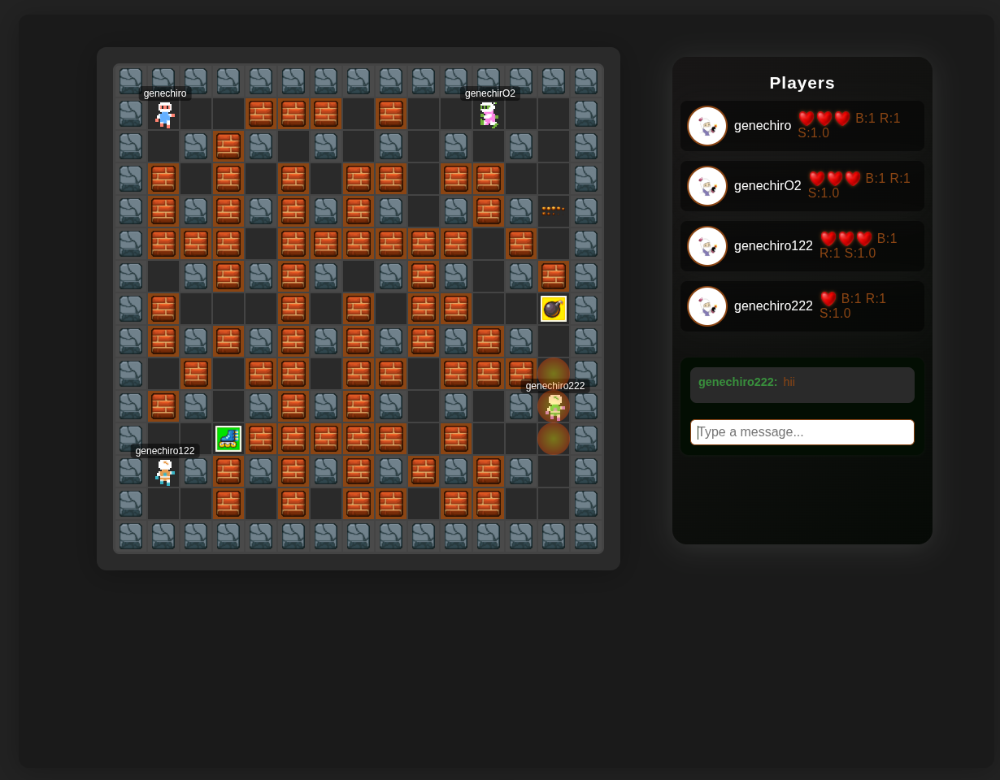

# Bomberman DOM

A browser-based multiplayer Bomberman-style game with a custom frontend framework and WebSocket server backend.

## Overview

This repository contains a full multiplayer game implementation split into client and server components. The client is a browser application built using a small custom JSX-like framework located in `Client/framework`. The server manages game rooms, real-time movement, bombs, explosions, power-ups, and player state over WebSocket connections.



## Architecture

The project is organized into two main parts:

- `Client/` - static browser client, including UI, game logic, and styles.
- `Server/` - Node.js WebSocket server and game engine.
- `assets/` - shared media assets, including the preview image used in this README.

### Client

The client is built as a browser app:

- `Client/index.html` - entry HTML file that loads the game.
- `Client/game/index.js` - bootstraps the game application.
- `Client/game/game.js` - application logic, state management, event handling, rendering, and animation.
- `Client/game/constants.js` - gameplay constants such as tile size, speed, and sprite paths.
- `Client/game/utils.js` - helper functions for tile rendering and power-up icons.
- `Client/framework/` - a minimal frontend framework providing `jsx`, `useState`, `useRef`, `useEffect`, and other components.
- `Client/style/` - styling for the main application UI and game board.

The client connects to the server using a WebSocket at `ws://<hostname>:8080` and updates the UI in response to messages from the server.

### Framework Usage

The client is built on top of the custom framework in `Client/framework/index.js`. This framework includes:

- `jsx` for declarative component creation and JSX-like syntax.
- `useState` for local component state management.
- `useRef` for mutable references that persist across renders.
- `useEffect` for side effects and lifecycle-like behavior.
- Component wrappers like `Div`, `H2`, `Input`, `Button`, `P`, `Ul`, `Li`, `Span`, and `H1`.

The framework is used in `Client/game/game.js` to define the game UI as a component tree and to manage dynamic updates for:

- player list and positions
- map and tile rendering
- bomb and explosion animations
- chat messages and status updates
- countdown and waiting timers

`Client/game/index.js` mounts the root `GameApp` component with `render('GameApp', GameApp)`, handing control of DOM rendering to the custom framework.

The framework section also demonstrates custom rendering for game state without external dependencies, keeping the client lightweight and tightly coupled to the game logic.

### Server

The server component is responsible for game state and real-time updates:

- `Server/server.js` - starts a WebSocket server, accepts client connections, and forwards messages to the game engine.
- `Server/game/game.js` - core game engine implementing rooms, map generation, countdowns, movement, bomb placement, explosion propagation, power-ups, game over state, and cleanup.
- `Server/game/room.js` - room abstraction storing players, bombs, power-ups, and game timers.
- `Server/game/player.js` - player object with identity, position, lives, bombs, flame range, speed, and socket reference.
- `Server/game/constants.js` - server-side game constants for states, player limits, timeouts, and power-up types.

## Key Features

- Multiplayer lobby and room matching
- Countdown-based game start
- Real-time player movement and bomb placement
- Explosion propagation with destructible blocks and power-ups
- Player elimination and game-over detection
- Chat broadcast messaging between connected players
- Graceful shutdown handling for SIGINT, SIGTERM, uncaught exceptions, and unhandled rejections

## Gameplay Mechanics

- Players join a room by entering a nickname.
- Rooms are created or reused while waiting for players, up to 4 players.
- Once at least 2 players join, a countdown starts and the game begins.
- Players move with arrow keys and place bombs with the space bar.
- Bombs explode after a timer and propagate until blocked by walls.
- Destructible blocks may spawn power-ups when destroyed.
- Power-ups increase bomb count, flame range, or speed.
- The last remaining player wins, and the match ends.

## Running the Project

### 1. Install server dependencies

Navigate to the server directory and install dependencies:

```bash
cd Server
npm install
```

### 2. Start the server

```bash
npm start
```

The WebSocket server listens on port `8080`.

### 3. Serve the client directory

The browser client must be loaded from a web server so the WebSocket hostname resolves correctly. From the `Client` directory, run a simple HTTP server.

Using Python:

```bash
cd ../Client
python3 -m http.server 3000
```

Then open the browser at:

```text
http://localhost:3000
```

### 4. Connect and play

- Enter a nickname and join the game.
- Move with the arrow keys.
- Place bombs with the space bar.
- Watch for power-ups and the game-over screen.

## Development Notes

- The client uses a custom lightweight framework rather than React or a mainstream library.
- The server is deliberately minimal and relies on the `ws` package for WebSocket communication.
- The game map is procedurally generated on room creation with fixed walls and random destructible blocks.
- Rooms are cleaned up after the game concludes or when all players disconnect.

## Project Structure

- `Client/index.html`
- `Client/game/index.js`
- `Client/game/game.js`
- `Client/game/constants.js`
- `Client/game/utils.js`
- `Client/framework/index.js`
- `Client/framework/package.json`
- `Client/style/game.css`
- `Client/style/style.css`
- `Server/server.js`
- `Server/package.json`
- `Server/game/game.js`
- `Server/game/room.js`
- `Server/game/player.js`
- `Server/game/constants.js`
- `assets/image.png`

## Notes

Because the client uses the browser hostname to connect to the server, it is recommended to run the client through a local HTTP server rather than opening the HTML file directly.
